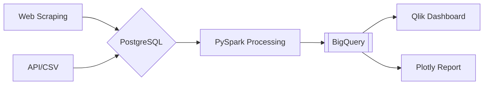

# 🚀 7-Day Data Engineering & Visualization Intensive

**Transform raw data into actionable insights** through a complete pipeline built with modern tools. Designed for analysts transitioning to engineering roles.

## 🔑 Key Technologies

| Tool              | Role in Project                          |
| ----------------- | ---------------------------------------- |
| **PostgreSQL**    | OLTP Database for transactional data     |
| **PySpark**       | Distributed processing of large datasets |
| **Airflow**       | Pipeline orchestration & scheduling      |
| **BeautifulSoup** | HTML parsing for web scraping            |
| **Selenium**      | Browser automation for JS-heavy sites    |
| **Qlik**          | Business intelligence dashboards         |
| **Plotly**        | Interactive data visualizations          |
| **Docker**        | Containerized database environments      |
| **BigQuery**      | Cloud data warehousing                   |

## 🎯 Learning Objectives

By the end of this intensive, you'll be able to:

✅ Build **ethical web scrapers** with rate limiting & JS handling  
✅ Design **slowly changing dimensions** (SCD Type 2)  
✅ Process big data using **PySpark** distributed computing  
✅ Orchestrate workflows with **Airflow DAGs**  
✅ Create production-ready **Qlik dashboards**  
✅ Develop interactive **Plotly reports**  
✅ Implement **cloud data pipelines** with BigQuery & GCS

## 📚 Tutorial Overview

### **Days 1-3: Core Foundations**

- **Web Scraping**: HTML parsing, headless browsers, ethical practices
- **Relational Databases**: OLTP vs OLAP, indexing, window functions
- **Data Modeling**: Star schema, slowly changing dimensions (Type 1/2)
- **ETL Development**: API/web scraping ingestion, data validation

### **Days 4-5: Scaling & Cloud**

- **Distributed Computing**: PySpark DataFrames, partitioning
- **Cloud Architecture**: GCS storage, BigQuery analytics, Parquet format

### **Days 6-7: Productionization**

- **Workflow Orchestration**: Airflow DAGs with sensors/operators
- **Visualization**: Qlik dashboards, Plotly interactive reports

## 📖 Core Vocabulary

**Essential terms you'll master during this intensive:**

| Term             | Definition                                                     |
| ---------------- | -------------------------------------------------------------- |
| **ETL**          | Extract-Transform-Load process for moving data between systems |
| **OLTP**         | Transactional databases optimized for writes (e.g. PostgreSQL) |
| **OLAP**         | Analytical databases optimized for reads (e.g. BigQuery)       |
| **Star Schema**  | Fact table + dimension tables data model                       |
| **SCD**          | Slowly Changing Dimensions (Type 1/2/3)                        |
| **DAG**          | Directed Acyclic Graph (Airflow workflow structure)            |
| **Data Lake**    | Raw data storage (GCS/S3) before processing                    |
| **Data Mart**    | Subset of data warehouse for specific use cases                |
| **Parquet**      | Columnar storage format for efficient analytics                |
| **Partitioning** | Splitting data by time/type for faster queries                 |
| **Idempotency**  | Designing pipelines to handle reruns safely                    |
| **Data Drift**   | Schema/statistical changes in production data                  |
| **Web Scraping** | Extracting data from websites programmatically                 |
| **SCD Type 2**   | Tracking historical dimension changes with validity dates      |

**Web Scraping Specific:**

- **robots.txt** → Website scraping permissions file
- **Headless Browser** → Browser without GUI for automation
- **Rate Limiting** → Polite scraping with request delays
- **XPath/CSS** → HTML element targeting methods

## 🏆 Capstone Project

**Enhanced Pipeline with Web Data:**



## 🛠️ Prerequisites

- Basic Python & SQL knowledge
- Docker Desktop installed ([guide](https://www.docker.com/products/docker-desktop/))
- Python 3.8+ with virtual environments
- **Web Scraping Requirements:**
  - Chrome/Firefox browser installed
  - Understanding of HTML/CSS basics
  - Ethical scraping practices knowledge
  - `pip install beautifulsoup4 selenium webdriver-manager`
- (Optional) GCP/AWS account for cloud modules

## 🚦 Getting Started

1. **Set Up Environment**:

```bash
# Day 0 Setup
docker run --name nyc-taxi-db -e POSTGRES_PASSWORD=admin -p 5432:5432 -d postgres
python -m venv de_env && source de_env/bin/activate
pip install -r requirements.txt
```

2. **Download Dataset**:

```bash
wget -P data/raw https://example.com/nyc-taxi.csv  # Replace with actual dataset
```

## 📦 End Products

1. **GitHub Repository**:

   - Production-grade ETL scripts
   - Jupyter notebooks with exploration
   - Airflow DAG definitions
   - Documentation (schema designs, pipeline diagram)

2. **Qlik Dashboard**:

   - Real-time taxi metrics
   - Driver performance analytics
   - Revenue trends by time period

3. **Plotly Report**:
   - Interactive fare analysis
   - Geospatial visualization of trips
   - Hourly demand heatmaps

**New Deliverables:**

- Web scraping legal compliance checklist
- Scraped data quality reports
- Headless browser configuration scripts
- Rate limiting implementation examples

---
